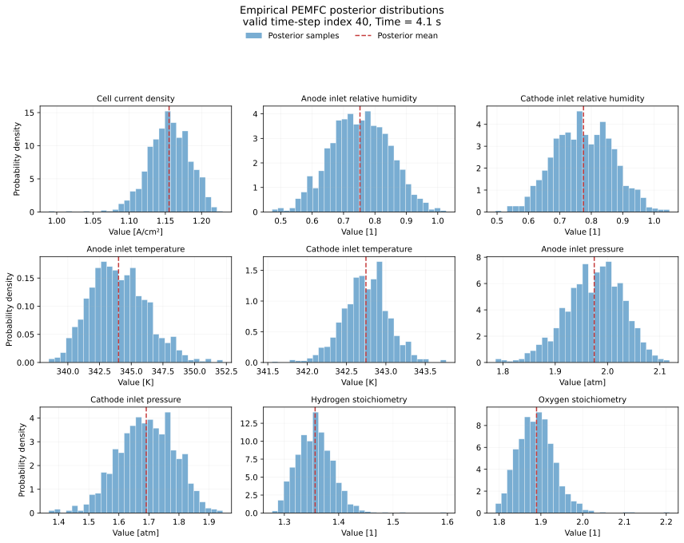

# VIPR Fuel Cell Plugin

This plugin demonstrates uncertainty-aware reconstruction of PEMFC operating
parameters from measurable sensor signals using a conditional invertible neural
network (cINN). It implements the inverse mapping described in:

R. Löser, S. Creutzburg, N. Mothes, and M. Dix, "Conditional invertible neural
network for online-capable monitoring of polymer electrolyte membrane fuel
cells," *International Journal of Hydrogen Energy* 250 (2026) 155929.
<https://doi.org/10.1016/j.ijhydene.2026.155929>

For every point in the sensor profile, the plugin reconstructs posterior
distributions for nine operating parameters:

| # | Reconstructed operating parameter | Unit |
| ---: | --- | --- |
| 1 | Cell current density | A/cm² |
| 2 | Anode inlet relative humidity | 1 (dimensionless) |
| 3 | Cathode inlet relative humidity | 1 (dimensionless) |
| 4 | Anode inlet temperature | K |
| 5 | Cathode inlet temperature | K |
| 6 | Anode inlet pressure | atm |
| 7 | Cathode inlet pressure | atm |
| 8 | Hydrogen stoichiometry | 1 (dimensionless) |
| 9 | Oxygen stoichiometry | 1 (dimensionless) |

The inverse mapping is conditioned on eleven measurable or derived quantities:

| # | Conditioning quantity | Unit |
| ---: | --- | --- |
| 1 | Cell voltage | V |
| 2 | Concentration loss | V |
| 3 | Ohmic loss | V |
| 4 | Hydrogen crossover loss | V |
| 5 | Activation loss | V |
| 6 | Anode limiting current density | A/cm² |
| 7 | Cathode limiting current density | A/cm² |
| 8 | Anode water flux | mol/(m² s) |
| 9 | Cathode water flux | mol/(m² s) |
| 10 | Anode hydrogen flux | mol/(m² s) |
| 11 | Cathode oxygen flux | mol/(m² s) |


## Example result

The bundled Test Case 1 example processes 300 valid sensor-profile steps and
draws 1,000 posterior samples per step.

### Posterior reconstruction at one operating point

The following snapshot shows the empirical marginal posteriors at valid
time-step index 40 (`t = 4.1 s`). Each histogram contains the 1,000 samples
generated by the inverse cINN; the dashed line marks its posterior mean. No
Gaussian fit or ground-truth value is superimposed.



### Reconstruction over the operating profile

The posterior mean of the reconstructed anode inlet pressure follows the
simulated operating-profile change:


## Components

- `pemfc_dataset` loads a curated sensor profile and its English metadata.
- `pemfc_cinn` directly loads a locally provisioned cINN and its min/max
  scalers. No VIPR registry loader is used.
- `PEMFCConditionPreprocessor` selects, validates and scales model conditions.
- `pemfc_posterior` samples and summarizes the conditional posterior.
- `PEMFCDataCollector` exports parameter summaries, mean trajectories, and
  configured empirical posterior snapshots.

The dataset loader requires explicit `data_path` and `metadata_path` values.
The model loader accepts either a named, provisioned model or an explicit
`checkpoint_path`. Relative file paths are resolved next to the VIPR config.
For a named model, the loader owns resolution, checksum validation, checkpoint
loading, scaler validation, and the consistency check between checkpoint names
and packaged presentation metadata.

## Installation

Clone VIPR Core and the fuel-cell plugin into the same parent directory:

```bash
git clone https://codebase.helmholtz.cloud/vipr/vipr-core.git
git clone https://github.com/HW-IT-Solutions/vipr-fuel-cell-plugin.git
```

Then install VIPR Core and the plugin:

```bash
pip install -e './vipr-core'
pip install -e './vipr-fuel-cell-plugin[test]'
```

The paper's Test Case 1 artifacts are currently stored in
`models/test_case_1/`. The checkpoint is versioned with Git LFS, while the small
scaler files are regular Git objects. Install Git LFS before cloning or run
`git lfs pull` afterwards; see [`models/README.md`](models/README.md).

An externally provisioned bundle can use the same layout below a configurable
root directory:

```bash
export VIPR_FUEL_CELL_ROOT_DIR=/path/to/vipr-fuel-cell-artifacts
```

```text
$VIPR_FUEL_CELL_ROOT_DIR/models/test_case_1/
├── checkpoint.ckpt
├── scaler_x.json
└── scaler_y.json
```

This is the target layout for moving the artifacts to Hugging Face later. The
repository ID and immutable revision will be added only after the redistribution
terms and hosting location are confirmed. The packaged metadata and SHA-256
manifest remain part of the plugin.

When running directly from a source checkout, the loader falls back to the
repository's `models/` directory. An installed wheel has no implicit model
location and therefore requires `VIPR_FUEL_CELL_ROOT_DIR` or an explicit
`checkpoint_path`. The artifact filenames `scaler_x.json` and `scaler_y.json`
are retained for compatibility with the published bundle; internally they are
exposed as the parameter and condition scaler.

## Run

The example config references packaged sensor data and metadata alongside a
logical model name. It has no machine-specific paths, sensor arrays, run IDs,
or registry entries.

```bash
vipr --config \
  @vipr_fuel_cell/examples/configs/pemfc_operating_state_reconstruction.yaml \
  inference run
```

The sensor CSV and its metadata are selected through explicit
`@vipr_fuel_cell/...` package-resource paths. The direct model loader selects
the paper's eleven-condition cINN as `test_case_1`.

### Use a custom sensor profile

Copy the example config and replace its `load_data` paths. Relative paths are
resolved from the directory containing the copied config:

```yaml
vipr:
  inference:
    filters:
      INFERENCE_PREPROCESS_PRE_FILTER:
        - class: vipr_fuel_cell.preprocess.condition_preprocessor.PEMFCConditionPreprocessor
          method: preprocess_conditions
          enabled: true
          weight: 0
          parameters:
            invalid_rows: drop
            out_of_range: warn
    load_data:
      handler: pemfc_dataset
      parameters:
        data_path: ../datasets/my_profile/sensor_data.csv
        metadata_path: ../datasets/my_profile/metadata.yaml
```

The preprocessing filter is required to select, order, validate, and scale the
conditions for the loaded cINN. Both `data_path` and `metadata_path` are
required. In the metadata, `column` identifies a CSV column and `name`
identifies the corresponding checkpoint condition. The order is arbitrary,
but all eleven conditions required by `test_case_1` must be present; additional
conditions are ignored by its preprocessor.

The example reconstructs all 300 valid sensor-profile steps. Its diagrams show
only the posterior mean over time; no uncertainty band, anomaly threshold, or
ground-truth series is implied. In addition, the configuration retains the
empirical marginal posteriors at valid time-step index 40 (`t = 4.1 s`), a
stable operating point before the pressure change. This produces:

- nine mean-trajectory diagrams with their CSV data;
- one SVG containing a 3 x 3 grid of empirical posterior histograms and their
  posterior means; and
- one CSV/TXT table containing the histogram bins, densities, counts, and
  posterior means used for that SVG.

VIPR also writes
`scripts/plot_pemfc_posterior_distributions_step_40.py` and its adjacent NPZ
data file into the result directory. The standalone script reproduces the SVG
without loading the model or requiring a VIPR installation.

The snapshot index is zero-based on the valid, preprocessed time axis. The
histograms visualize the sampled posterior directly; no Gaussian fit is used.

## License

The source code is licensed under the GNU Lesser General Public License v3.0 or
later (`LGPL-3.0-or-later`); see [`LICENSE.txt`](LICENSE.txt). The project
authors are listed in [`AUTHORS.md`](AUTHORS.md).

The trained model and bundled research data may be subject to additional rights
and approvals described in [`NOTICE.md`](NOTICE.md).
