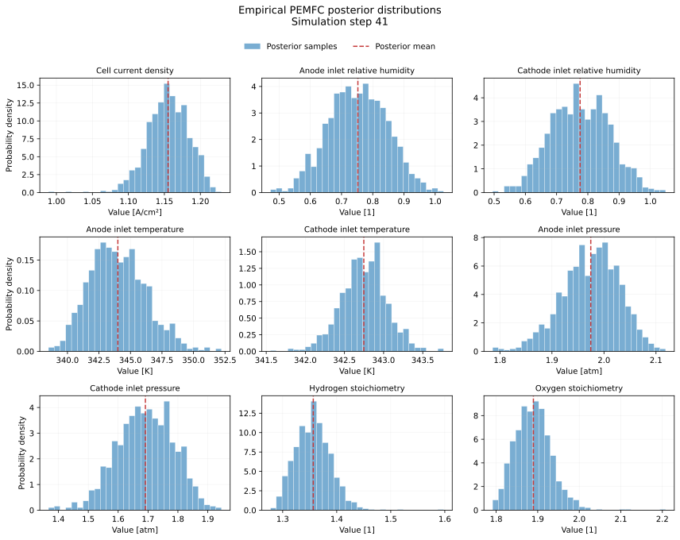
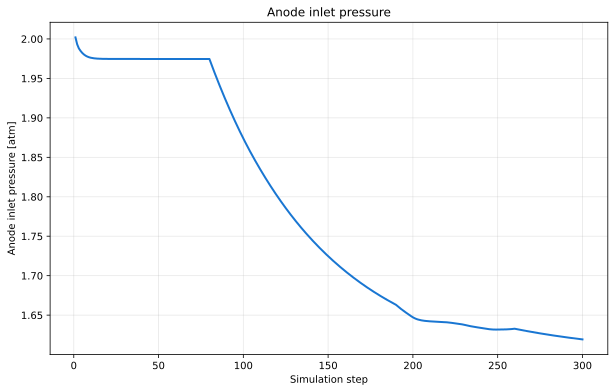
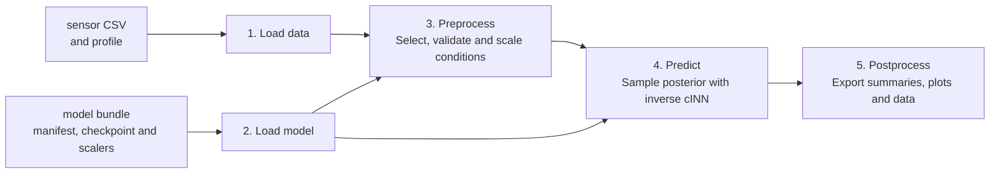

# VIPR Fuel Cell Plugin

[](https://doi.org/10.5281/zenodo.22078852)

This plugin reconstructs operating parameters of a polymer electrolyte membrane
fuel cell (PEMFC) from measurable or derived quantities. A conditional
invertible neural network (cINN) returns a posterior distribution for each
operating parameter instead of a single point estimate.

The implementation demonstrates that VIPR supports an inverse problem beyond
reflectometry. It reproduces Test Case 1 from:

R. Löser, S. Creutzburg, N. Mothes, and M. Dix, "Conditional invertible neural
network for online-capable monitoring of polymer electrolyte membrane fuel
cells," *International Journal of Hydrogen Energy* 250 (2026) 155929.
<https://doi.org/10.1016/j.ijhydene.2026.155929>

## Quick start

Python 3.10 or newer is required. Extract the plugin release archive and place
it next to a checkout of VIPR Core:

```bash
git clone https://codebase.helmholtz.cloud/vipr/vipr-core.git
```

The parent directory should then contain `vipr-core/` and
`vipr-fuel-cell-plugin/`. The release archive includes the complete model
checkpoint. Git LFS is only required when obtaining the plugin from a Git
repository instead of the release archive.

Install both packages:

```bash
pip install -e './vipr-core'
pip install -e './vipr-fuel-cell-plugin[test]'
```

Run the packaged example:

```bash
vipr --config \
  @vipr_fuel_cell/examples/configs/pemfc_operating_state_reconstruction.yaml \
  inference run
```

The example uses packaged sensor data and metadata. Its complete verified model
bundle is stored in `models/test_case_1/`; see
[`models/README.md`](models/README.md) for provisioning details.
To run the plugin with your own sensor profile or model bundle, follow the
[usage and configuration guide](docs/usage.md).

## Example results

For each of the 300 processed simulation steps, the cINN uses a sensor profile
of eleven measured or derived input quantities and generates 1,000 joint
samples of nine operating parameters. These samples represent the reconstructed
posterior distribution.

At simulation step 41, the figure shows the empirical marginal posterior
distributions of all nine operating parameters. The dashed lines mark their
posterior means.



The posterior mean of the reconstructed anode inlet pressure follows the
simulated operating-profile change:



The full list of conditioning quantities and reconstructed parameters is
documented in the [model and data interface](docs/model-interface.md).
A curated export of the complete example run is available under
[`example-results/`](example-results/README.md).

## Workflow

The plugin follows VIPR's five-step inference workflow:



The [architecture guide](docs/architecture.md) traces the data and model through
these five steps and explains the VIPR handlers, preprocessing filter, and
result hook used by the plugin.

## Acknowledgements

The VIPR Fuel Cell Plugin was developed by Helm & Walter IT-Solutions GmbH
(SaxonyAI) in collaboration with the Fraunhofer Institute for Machine Tools and
Forming Technology IWU.

## License

The source code is licensed under the GNU Lesser General Public License v3.0 or
later (`LGPL-3.0-or-later`); see [`LICENSE.txt`](LICENSE.txt). The project
authors are listed in [`AUTHORS.md`](AUTHORS.md).

The trained model, bundled research data, and derived example results may be
subject to additional rights and approvals described in
[`NOTICE.md`](NOTICE.md).
