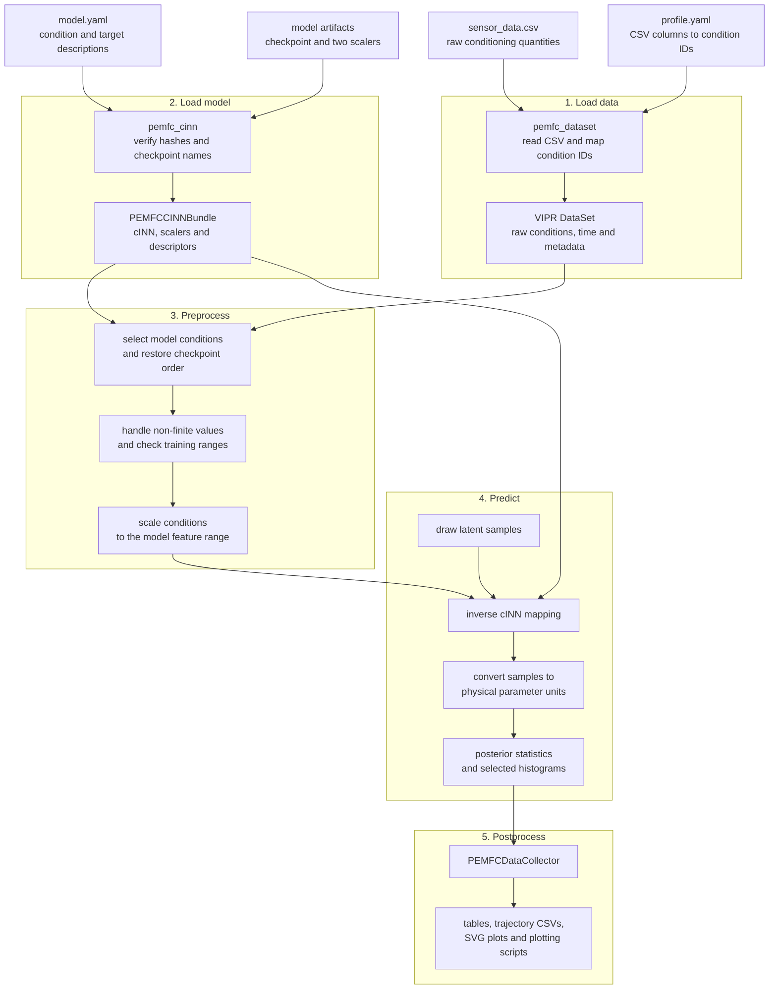

# Architecture

The fuel-cell plugin implements the standard five-step VIPR inference workflow.
The core remains domain-independent; PEMFC behavior is provided through plugin
handlers, a preprocessing filter, and a result-collection hook.

## Processing flow

## Plugin components

- `pemfc_dataset` loads a sensor profile from CSV and maps columns to stable
  condition IDs using `profile.yaml`.
- `pemfc_cinn` loads `model.yaml`, verifies the checkpoint and scaler hashes,
  and validates checkpoint tensor names. It does not use a VIPR registry
  loader.
- `PEMFCConditionPreprocessor` selects, orders, validates, and scales the model
  conditions. It runs as `INFERENCE_PREPROCESS_PRE_FILTER`.
- `pemfc_posterior` performs the inverse cINN mapping, samples the conditional
  posterior, and computes parameter-wise statistics.
- `PEMFCDataCollector` runs from the postprocess extension point and exports
  summaries, trajectories, and selected empirical posterior snapshots.

Preprocessing and result collection are extension callbacks rather than
preprocess and postprocess handlers. The example configuration therefore keeps
the corresponding handler values empty.

## Runtime data

The loader returns a VIPR `DataSet` with one row per sensor-profile point.
After preprocessing:

- `x[i]` contains the selected and scaled model conditions;
- `y[i]` contains the corresponding profile coordinate, such as a simulation
  step or time value;
- metadata records the selected condition IDs, indices of removed rows, and
  the number of values outside the model's training ranges.

The predictor processes profile points in batches and stores posterior mean,
standard deviation, minimum, maximum, and configured quantiles for every
reconstructed parameter. Posterior samples are discarded after each batch.
For explicitly selected snapshot indices, the predictor additionally retains
binned marginal histograms used by the example figure.

The collector exports tables, diagram data, SVG images, and standalone plotting
scripts through VIPR's regular result storage. See [usage and
configuration](usage.md#generated-outputs) for the generated files.
